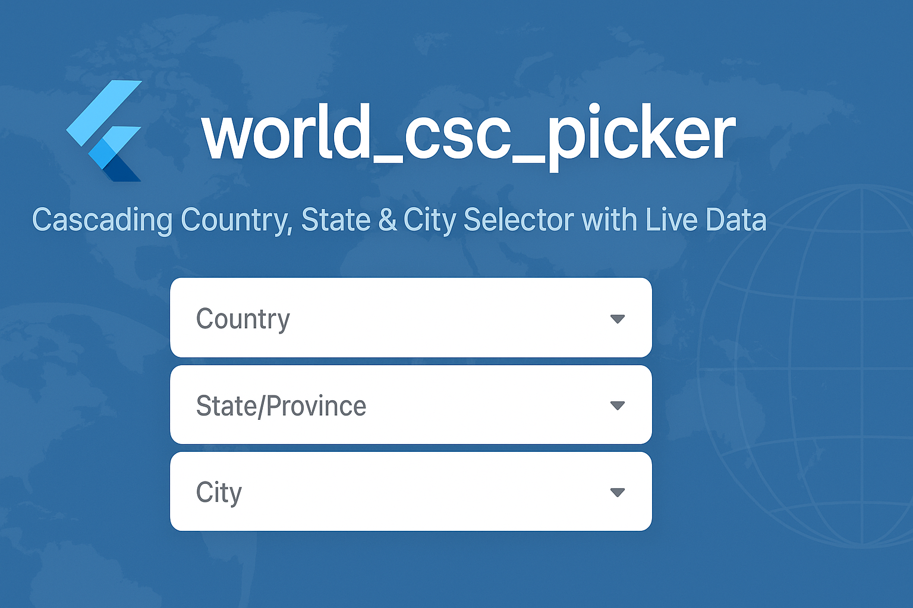
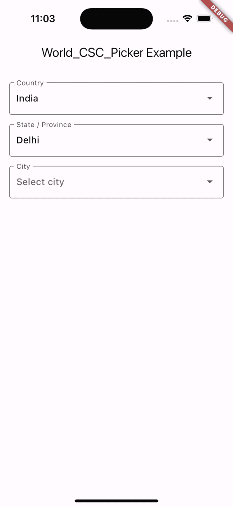

# 🌍 world_csc_picker

A lightweight and customizable Flutter widget for cascading **Country → State/Province → City** selection, using globally updated city data from a local JSON file.



---

## ✨ Features

- 📦 **Offline Support** – Uses a bundled `worldcities.json` file, so no API call or internet access is needed
- 🌍 **Cascading Dropdowns** – Country selection filters available States, which in turn filters Cities
- ⚡ **Zero Dependencies** – Built using pure Flutter without third-party packages
- 🧩 **Flexible Integration** – Easily embeds into forms, registration flows, or profile pages
- 🔄 **Dynamic Events** – Provides real-time callbacks when the country, state, or city changes
- 🎯 **Efficient Filtering** – Built-in optimization for large datasets (100,000+ cities)

---

## 📷 Preview

Here’s how the picker looks in a typical Flutter app:



---

## 🚀 Installation

1. Add the package to your `pubspec.yaml` file:

```yaml
dependencies:
  world_csc_picker: ^0.0.3
